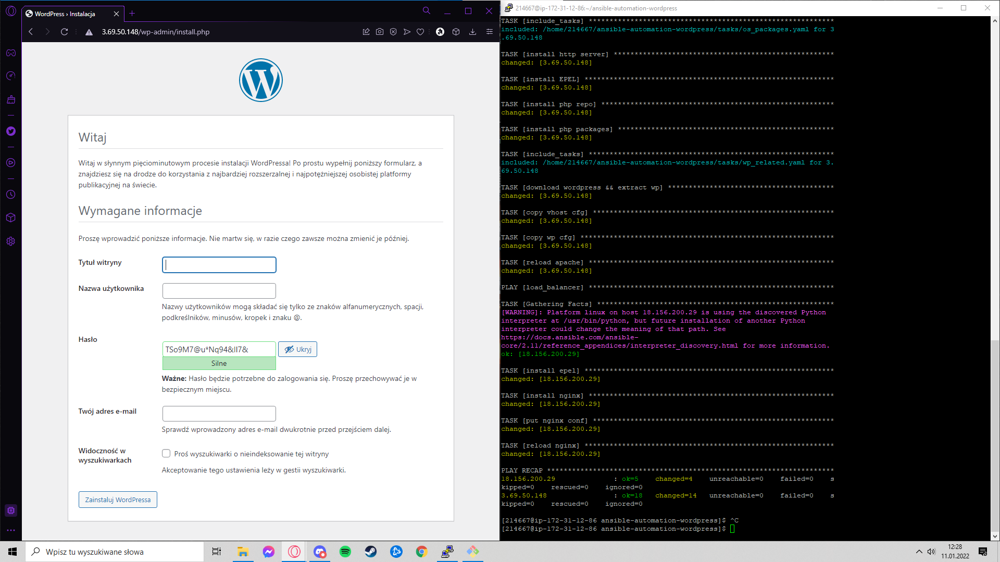

## Automatyzacja instalacji WordPressa

1. Stworzenie repozytorium
2. Wejście na sokratesa przez klienta SSH
3. eval ssh-agent
4. Dodanie klucza prywatnego do agenta
5. Wejście do maszyn AWS
6. Sklonowanie repozytorium na maszynę sokratesa
7. Uruchomienie Ansibla i jego playbooka (pliku yaml)

